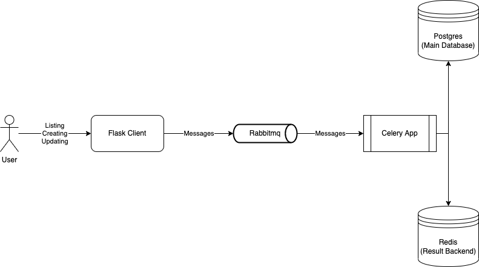

# Instruction

## Overview
This project is the simple sample to learn Celery.\
Its main functionalities consist of:
- Creating a new rectangle: provide **a** and **b** as width and height of new rectangle.
- Updating an existing rectangle: calculate area and perimeter of existing rectangle (its id must be provided). If there is not any rectangle with provided id, just ignore the updating operation.
- Listing existing rectangles: show all existing rectangles in Postgres database.

To perform those 3 features, I use Celery and Rabbitmq to queue and manage message routing.\
The architecture is described as below:\


## Prerequisite
- docker with compose plugin (current testing version: 20.10.16)

## Deploy
```
cd docker
docker compose build
docker compose up -d
```

## Usage
There are 5 containers:
- **kromlab_client**: A simple Flask GUI to perform 3 above features as a user. The server is listening on port 5000.\
  To list all existing rectangles:\
  http://localhost:5000/rectangle/ \
  To create a new rectangle (**value_a** and **value_a** are integer):\
  http://localhost:5000/rectangle/create?a={value_a}&b={value_b} \
  To update an existing rectangle (**id** is integer):\
  http://localhost:5000/rectangle/update/{id}
- kromlab_worker: The celery app is running on this container.
- kromlab_database: Postgres database.
- kromlab_broker: Rabbitmq broker.
- kromlab_result_backend: Redis database to store Celery task result.

